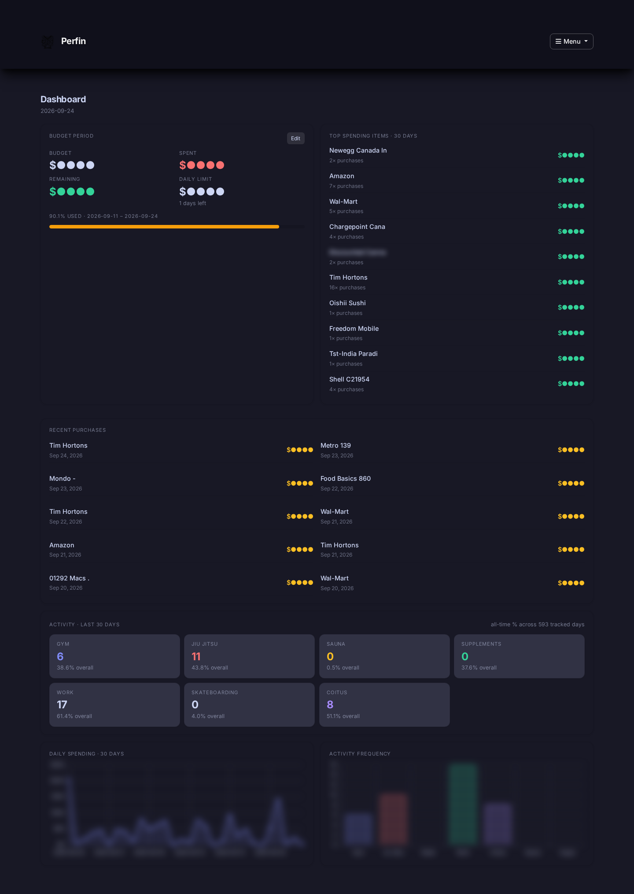
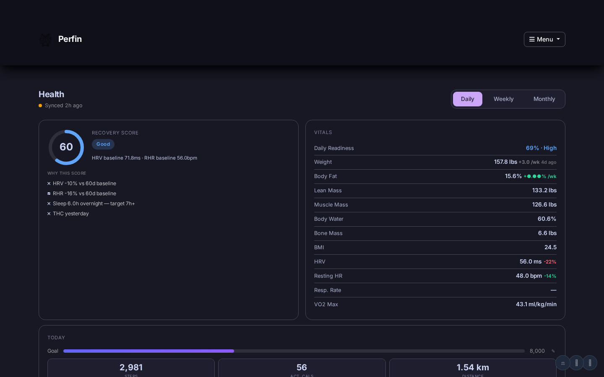
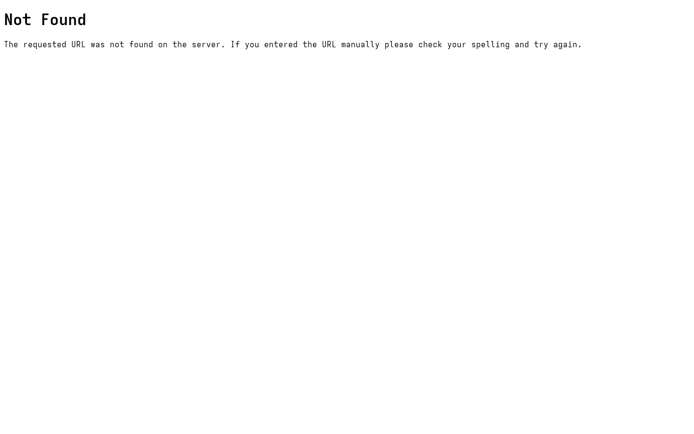

# Perfin

Personal finance and health dashboard — full-stack web app built in Python (Flask), running in production on a self-hosted Docker stack since 2024.

**Live on:** private home server (Tailscale-accessible)

---

## What it does

- **Finance** — real-time portfolio tracking (TFSA, RRSP, Non-Reg, IBKR, Savings), daily snapshot cron via Yahoo Finance API, spending log fed by automated BMO email sync (Gmail API)
- **Health** — Apple Health ingestion pipeline (steps, sleep, HRV, resting HR, calories) → InfluxDB time-series; Withings Body+ scale via OAuth2 callback (weight, body fat %, muscle mass)
- **Correlations** — cannabis, caffeine, alcohol, supplement tracking correlated against health metrics over time
- **AI brief** — daily health + finance summary generated via Ollama (local LLM)
- **Portfolio charts** — sparklines, balance history, account breakdowns, gain/loss tracking
- **Kiosk mode** — fullscreen dashboard with Immich photos, Nextcloud CalDAV events, weather, portfolio at a glance

---

## Tech Stack

| Layer | Stack |
|-------|-------|
| Backend | Python · Flask · REST API |
| Data stores | SQLite (finance/spending) · InfluxDB (health time-series) |
| Integrations | Yahoo Finance API · Gmail API · Withings OAuth2 · Apple Health (HAE export) · Ollama LLM |
| Infrastructure | Docker · Arch Linux · Tailscale · Caddy reverse proxy |
| Frontend | Jinja2 templates · Chart.js · vanilla JS |

---

## Screenshots

> Portfolio balances, spending amounts, and health metrics are blurred in all screenshots.

| View | Description |
|------|-------------|
|  | Main dashboard — portfolio balances, daily change, spending log |
|  | Health overview — weight, steps, HRV, sleep trends |
|  | Portfolio history and account breakdown charts |
|  | Kiosk mode — fullscreen overview with photos and calendar |

---

## Architecture

```
Apple Health ──► HAE export ──► POST /health/ingest ──► InfluxDB
Withings Body+ ─────────────► OAuth2 callback ────────► SQLite
BMO email ──────────────────► Gmail API ──────────────► SQLite (spending_log)
Yahoo Finance ───────────────► cron snapshot ──────────► SQLite (portfolio)
                                                              │
                                                         Flask app
                                                              │
                                                    Ollama (daily brief)
```

---

## Status

Private repository — code not public due to personal financial data in config. This repo contains screenshots and documentation only.
